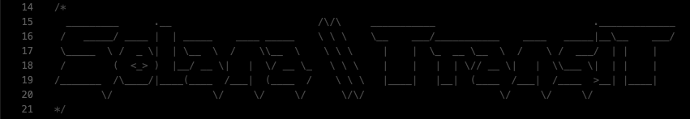

# Solana Transit

**Solana Transit** is a decentralized package delivery management system built on the Solana blockchain. It enables the transparent, secure, and immutable tracking of packages as they are transported by multiple couriers. The system ensures that each courier receives their rewards only upon successful delivery and provides a tamper-proof history of the entire delivery process.

---

## Features

### 1. **Package Creation**
   - Users can create packages by specifying the **couriers** involved in the delivery process, each courier's **predefined reward**, and the **encrypted secret details** for each courier. 
   - Each courier must be provided with their **public RSA key**, which ensures that delivery details are encrypted and can only be decrypted by the respective courier using their private key.
   - The package details, including delivery instructions, are securely stored on the Solana blockchain.

### 2. **Encrypted Delivery Details**
   - Sensitive information, such as **pickup location**, **pickup time**, **delivery location**, and **delivery time**, is encrypted using RSA encryption.
   - Each courier receives a unique encrypted message relevant to their part of the job, ensuring they can only access the information necessary for their task.
   - The system ensures that no other courier can decrypt or view the details of the other couriers' parts of the journey, preserving privacy.

### 3. **Courier Management**
   - Couriers can **pickup** and **deliver** packages by confirming the receipt and delivery via blockchain transactions. Each step of the process is recorded on-chain for transparency.
   - After a courier delivers a package to the next courier, the **previous courier** automatically receives their predefined reward.
   - If a package reaches its final destination, the final courier will receive their reward upon successful delivery, ensuring fair compensation for all involved parties.

### 4. **Package Tracking and Accountability**
   - The system provides **real-time tracking** of packages, allowing users to see the current holder (courier) and monitor the entire delivery process.
   - Every **pickup** and **delivery** event is timestamped and logged, ensuring accountability.
   - If any delays or issues occur, it is possible to trace and **blame** specific couriers for any problems, thanks to the immutable nature of blockchain transactions.

### 5. **Automated Reward Distribution**
   - The system ensures that rewards are automatically distributed to couriers upon successful delivery or pickup, streamlining the process and minimizing the need for manual intervention.
   - Reward transactions are recorded on the blockchain, ensuring they are transparent and verifiable.

---
